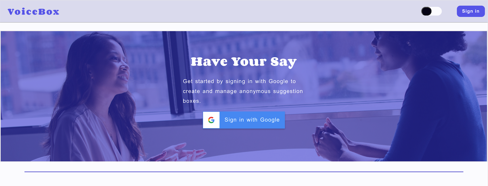
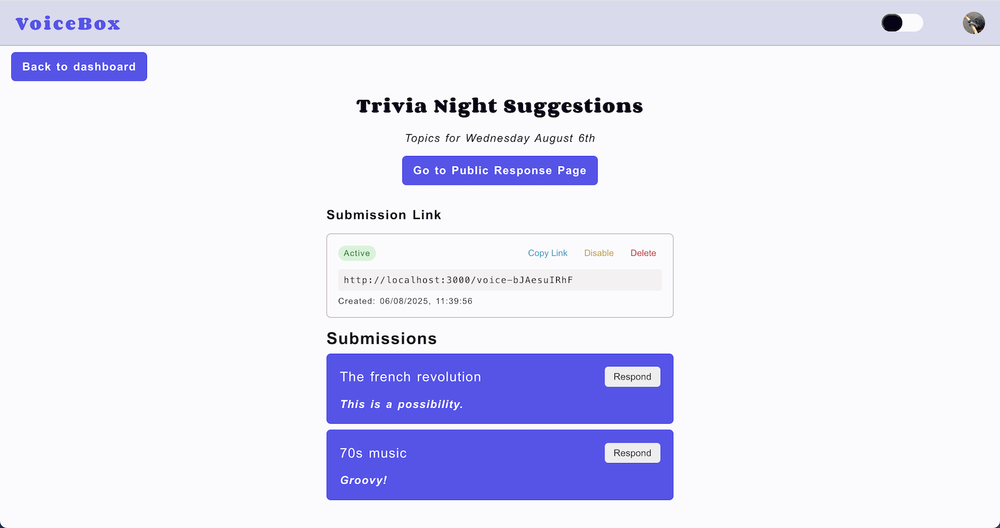

# VoiceBox

VoiceBox is a simple and secure anonymous suggestion box for workplaces, communities, or schools. It empowers open communication by allowing anyone to submit feedback anonymously, while giving admins a streamlined way to review and respond to submissions.

### Key Features

- **Create a Box** – Admins can quickly set up a new suggestion box and generate a unique link to share with their team, group, or community.
- **Anonymous Submissions** – Users can submit honest, anonymous feedback without needing to sign in or reveal their identity.
- **Admin Dashboard** – Admins can view all submissions, respond to them directly, and manage feedback from a clean and focused interface.




## Getting Started

### 1. Clone the Repository

```bash
git clone https://github.com/your-username/voicebox.git
cd voicebox
```

### 2. Install Dependencies

```bash
npm install -g pnpm@latest-10
pnpm install
```

### 3. Set Up Environment Variables

- Create a `.env` file in the root directory
- Copy the contents from `.env.example` into it
- Fill in the required values:

```env
GOOGLE_CLIENT_ID=your-google-client-id
GOOGLE_CLIENT_SECRET=your-google-client-secret

NEXTAUTH_URL=http://localhost:3000
NEXTAUTH_SECRET=your-random-generated-secret
```

Generate a secure secret with:

```bash
openssl rand -base64 32
```

### 4. Generate Prisma Client

```bash
pnpm dlx prisma generate
```

### 5. Start the Dev Server

```bash
pnpm dev
```

Click `Sign In with Google` on the homepage to authenticate and access the admin dashboard.

## Seeding the Database

1. Ensure you've already signed in with Google
2. Run the following (replace the email with your own):

```
pnpm db:seed --email=youremail@example.com
```

You should now see an example box and some test suggestions in the admin dashboard.

## Project Structure

```
/
├── app/                    # Next.js App Router pages
│   ├── api/                # API routes
│   │   ├── auth/           # Google OAuth and NextAuth
│   │   ├── boxes/          # Create & retrieve suggestion boxes
│   │   ├── submissions/    # Submit & retrieve anonymous feedback
│   │   ├── voicebox/       # Validate and route to appropriate pages
│   │   └── links/          # Retrieve generated links
│   ├── box/                # Public page for viewing submissions & responses
│   ├── components/         # Reusable components
│   ├── dashboard/          # Admin dashboard
│   ├── hooks/              # Custom React hooks
│   ├── styles/             # Global CSS
│   └── submit/             # Page for submitting anonymous suggestions
├── middleware.js           # URL rewrites and routing logic
├── lib/                    # Shared libraries and utilities
├── prisma/                 # Prisma schema and queries
├── utils/                  # Utility functions
├── public/                 # Static assets
└── README.md               # Documentation
```

## Tech Stack

- Next.js 14 (App Router)
- JavaScript + CSS
- Prisma + MongoDB
- NextAuth.js (Google OAuth)

## Contributors

- [Luke Sullivan](https://github.com/sukelully)
- [JoJo](https://github.com/JoJoJo-JoJoJo)
- [Michael Boateng](https://github.com/michaelboateng1)
- [Teddy ASSIH](https://github.com/Ionfinisher)
- [Alexandra Cromarty](https://github.com/AlexandraCromarty)

## License

This project is licensed under the [MIT License](LICENSE).
