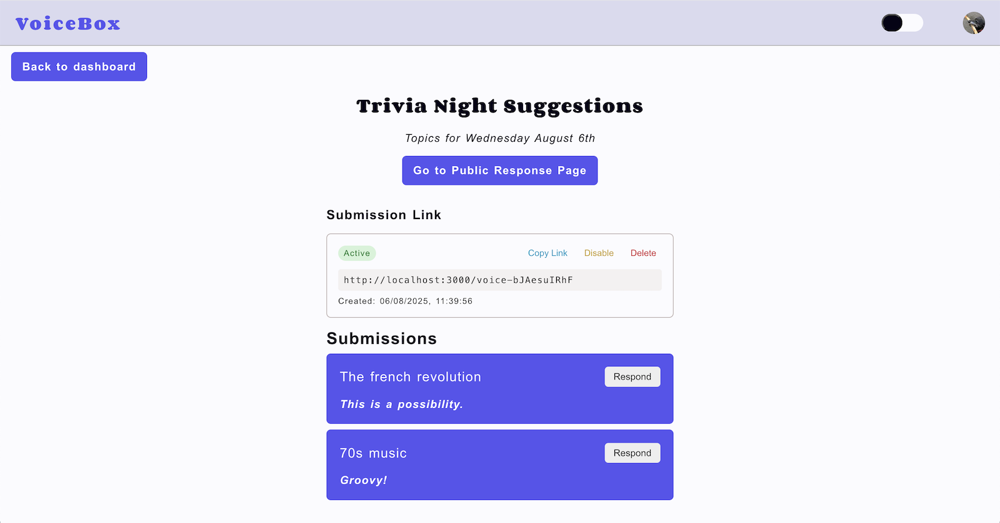

# VoiceBox

VoiceBox is a simple and secure anonymous suggestion box for workplaces, communities, or schools. It empowers open communication by allowing anyone to submit feedback anonymously, while giving admins a streamlined way to review and respond to submissions.

### Key Features

- **Create a Box** – Admins can quickly set up a new suggestion box and generate a unique link to share with their team, group, or community.
- **Anonymous Submissions** – Users can submit honest, anonymous feedback without needing to sign in or reveal their identity.
- **Admin Dashboard** – Admins can view all submissions, respond to them directly, and manage feedback from a clean and focused interface.




## Prerequisites

### NodeJS and NPM

Check you have Node and NPM installed:

`node -v`

If not, you can install them by going to [NodeJS installation guide](https://nodejs.org/en/download).

### PNPM

You can install pnpm with:

`npm install -g pnpm@latest-10`

## Installing dependencies

`pnpm install`

## Prisma Setup

In order to generate the prisma client, follow these steps:

- Create a .env file contaning the .env.example content
- Generate the client with `pnpm dlx prisma generate`

## Auth Setup

1. Make sure you have updated the following environment variables on `.env`:

```
GOOGLE_CLIENT_ID=google-client-id
GOOGLE_CLIENT_SECRET=google-client-secret

NEXTAUTH_URL=http://localhost:3000
NEXTAUTH_SECRET=run `openssl rand -base64 32` and replace here
```

2. Update prisma client:

```
pnpm prisma generate
```

3. Test Google sign-in:

```
pnpm dev
```

- Sign in with Google by click 'Sign In' the top right of the header
- You should be redirected to the admin dashboard

## Seeding the database

1. Ensure you have already signed up with Google
2. Run `pnpm db:seed --email=youremail@example.com`
3. You should now see an example box and suggestions on the admin dashboard

## Project Structure

```
/
├── app/                    # Next.js app router pages
│   ├── api/                # API routes
│   │   ├── auth/           # User authentication with Google OAuth and NextAuth
│   │   ├── boxes/          # Endpoints to create and retrieve anonymous suggestion boxes
│   │   ├── submissions/    # Endpoints to submit and retrieve anonymous submissions for each box
│   │   ├── voicebox/       # Endpoints to validate and redirect to the appropriate page
│   │   └── links/          # Endpoints to retrieve generated links
│   ├── box/                # Public-facing page for viewing submissions and admin responses
│   ├── dashboard/          # Admin dashboard for managing boxes and responding to submissions
│   ├── submit/             # Public-facing page for submitting anonymous suggestions to a box
│   ├── hooks/              # Custom React hooks for fetching data
│   ├── components/         # Reusable React components
│   └── styles/             # Global and module CSS for styling the app
├── middleware.js           # Middleware handling URL rewrites and routing logic
├── lib/                    # Shared libraries and utilities
├── prisma/                 # Prisma schema and queries
├── utils/                  # Utilities and helpers for the project
├── public/                 # Static assets
└── README.md               # Documentation for local setup
```
